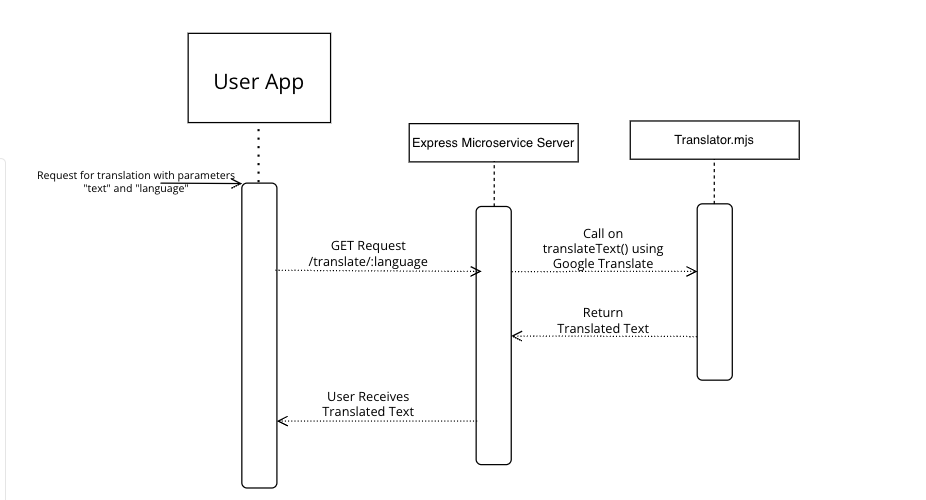

# Translation Microservice Communication Contract

This is a Node.js microservice that provides text translation functionality using a translation NPM module. It is designed to be access in a simple REST API.

## Usage

The microservice provides a single accesspoint "/translate:language". The service requires two parameters

1. "language" -- A string representing the language to translate the text to.
2. "text" -- A string, in english that you'd like to see translated.

To use the microservice, make an HTTP Get request to the endpoint with the above parameters.

Example Requests:

http://localhost:3777/translate/Spanish?text=Hello%20World

returns "Hola Mundo"

http://localhost:3777/translate/French?text=Hello%20World

returns "Bonjour le monde"

## UML sequence diagram
